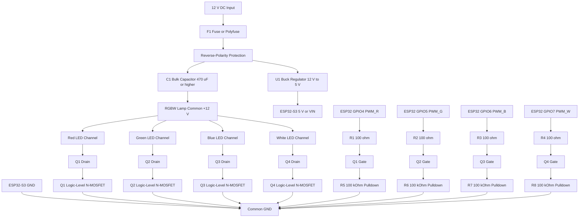

# Lumina RGBW PWM Driver Hardware

This is the first implementation schematic for the Lumina 12 V RGBW lamp driver. It assumes a finished 12 V common-anode RGBW LED lamp or strip with internal current limiting. If the LED module is a bare high-power LED package, replace the direct MOSFET switching stage with four constant-current LED drivers.

## Electrical Assumptions

- LED load: 12 V common-anode RGBW lamp or strip.
- LED output connector: `+12V`, `R-`, `G-`, `B-`, `W-`.
- Control method: low-side PWM switching for each color channel.
- Controller: ESP32-S3-N16R8 running HomeSpan firmware.
- Default PWM pins: `GPIO4` red, `GPIO5` green, `GPIO6` blue, `GPIO7` white.
- PWM frequency: 5 kHz.
- PWM resolution: 12 bit.
- Logic level: ESP32 3.3 V GPIO directly drives logic-level MOSFET gates through series resistors.

## Circuit Diagram



## One-Channel Wiring Pattern

Each RGBW channel repeats the same low-side switch:

```text
+12 V  -> LED channel anode
LED channel cathode -> MOSFET drain
MOSFET source -> common GND
ESP32 PWM GPIO -> 100 ohm resistor -> MOSFET gate
MOSFET gate -> 100 kOhm resistor -> common GND
```

For a common-anode RGBW strip, the strip has one shared `+12V` wire and four switched negative wires. Do not put the MOSFET between the 12 V supply and the shared positive wire if you want independent color control.

## Suggested Parts

- Q1 to Q4: logic-level N-MOSFET, rated for at least 30 V drain-source voltage and at least 2x the expected channel current. Use a part with specified low `Rds(on)` at 2.5 V or 3.3 V gate drive.
- R1 to R4: 100 ohm gate resistors.
- R5 to R8: 100 kOhm gate pulldown resistors.
- F1: fuse or resettable polyfuse sized slightly above the expected full-white current.
- C1: 470 uF or larger electrolytic capacitor near the LED connector, voltage rating at least 25 V.
- C2: 100 nF ceramic capacitor near the LED connector for high-frequency noise.
- U1: buck regulator from 12 V to the ESP32 board input voltage. Use 5 V into `VIN`/USB input unless your exact board requires regulated 3.3 V.
- D1: reverse-polarity protection with either a Schottky diode for simple prototypes or a P-channel MOSFET ideal-diode circuit for better efficiency.
- J1: 12 V input connector rated above the maximum lamp current.
- J2: 5-pin RGBW output connector rated above the maximum per-channel current.

For low-power prototypes below about 1 A per channel, an AO3400-class MOSFET is usually practical. For higher-power strips or enclosed lamp bodies, choose a larger package with lower thermal resistance and confirm case temperature during full-white operation.

## ESP32-S3 Pin Notes

The firmware defaults to:

- `GPIO4`: red PWM
- `GPIO5`: green PWM
- `GPIO6`: blue PWM
- `GPIO7`: white PWM
- `GPIO48`: built-in status LED only

Before soldering, confirm that the exact ESP32-S3-N16R8 development board exposes these pins and does not use them for boot mode, USB, flash, PSRAM, onboard peripherals, or reserved board functions. If needed, override the pins in the sketch with `PWM_R_PIN`, `PWM_G_PIN`, `PWM_B_PIN`, and `PWM_W_PIN`.

## Protection And Layout Notes

- Keep the high-current 12 V LED traces short and wide.
- Star the LED power return and ESP32 ground at the power input or power stage ground area.
- Place the 100 kOhm pulldown resistors close to the MOSFET gates.
- Place the bulk capacitor close to the RGBW output connector.
- Add ventilation or metal thermal spreading if full-white power exceeds a few watts.
- If the lamp cable is long, add a TVS diode across the 12 V rail near the connector.
- Label the output connector clearly: `+12V`, `R-`, `G-`, `B-`, `W-`.

## Bring-Up Test

1. Power the ESP32 from USB only and confirm the firmware boots.
2. With no LED load connected, measure each MOSFET gate and confirm it stays low during boot.
3. Use HomeKit to set red, green, blue, and white states and confirm the correct GPIO produces PWM.
4. Connect a current-limited bench supply at 12 V before using the final adapter.
5. Test each channel individually at 25%, 50%, and 100% brightness.
6. Test full white with all channels active and measure MOSFET temperature after 10 minutes.
7. Power-cycle the lamp and confirm the LEDs stay off until HomeSpan restores or receives a command.
