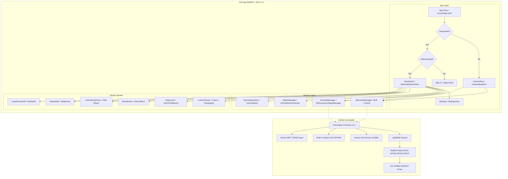
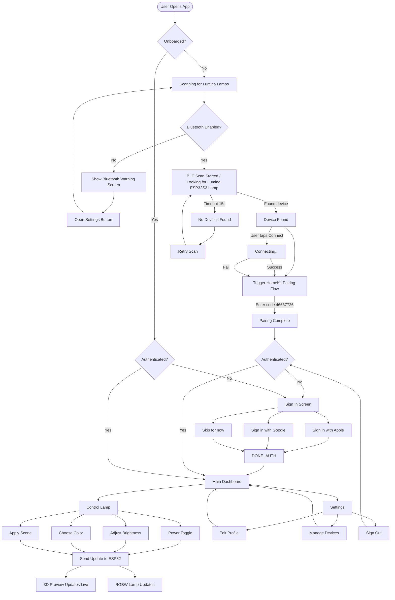
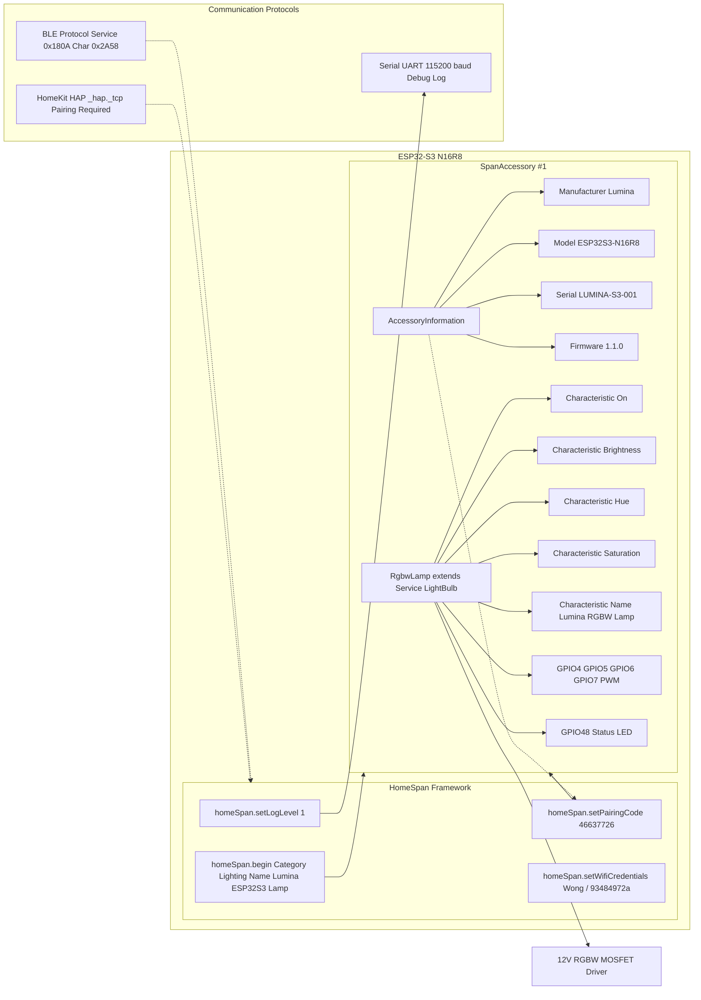
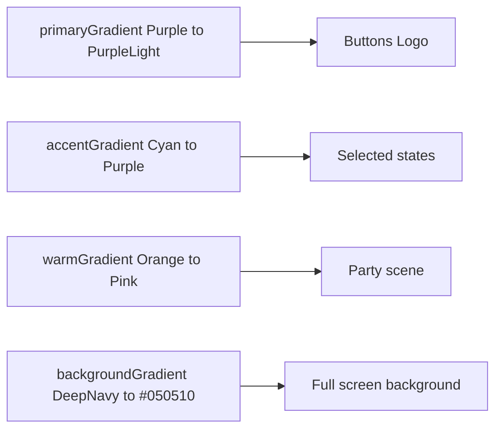

# Lumina Smart Lamp Companion App

A cyber-premium iOS companion app for the Lumina ESP32-S3 Smart Lamp, featuring a glassmorphic dark UI, RealityKit 3D lamp preview, HomeKit integration, and BLE connectivity.

---

## Table of Contents

- [Project Overview](#project-overview)
- [System Architecture](#system-architecture)
- [App User Flow](#app-user-flow)
- [Hardware Communication Flow](#hardware-communication-flow)
- [HomeSpan Firmware Overview](#homespinfirmwareoverview)
- [Architecture](#architecture)
- [Hardware Integration](#hardware-integration)
- [Design System](#design-system)
- [Project Setup](#project-setup)
- [License](#license)

---

## Project Overview

Lumina bridges three layers:

```
┌──────────────────────────────────────────────────────────────┐
│                     iOS Lumina App                            │
│  ┌──────────┐  ┌──────────┐  ┌──────────┐  ┌──────────┐    │
│  │ Onboard  │> │  Auth    │> │Dashboard │> │Settings │     │
│  └──────────┘  └──────────┘  └──────────┘  └──────────┘    │
│         │            │            │            │             │
│  ┌──────┴────────────┴────────────┴────────────┴───────┐   │
│  │        BluetoothManager      HomeKitManager           │   │
│  └────────────────────┬──────────────────────────────────┘   │
└───────────────────────┼─────────────────────────────────────┘
                        │ BLE (Service 0x180A) + HomeKit HAP
┌───────────────────────┼─────────────────────────────────────┐
│                 ESP32-S3-N16R8                               │
│  ┌────────────────────┴──────────────────────────────────┐  │
│  │              HomeSpan Firmware                          │  │
│  │   ┌──────────────┐  ┌────────────────────────────┐    │  │
│  │   │ RGBW Light   │  │  Device Information (0x180A)│    │  │
│  │   │ Service      │  │  - Manufacturer: Lumina     │    │  │
│  │   │ H/S/B + PWM  │  │  - Model: ESP32S3-N16R8    │    │  │
│  │   └──────────────┘  │  - Serial: LUMINA-S3-001  │    │  │
│  │                      └────────────────────────────┘    │  │
│  └────────────────────┬──────────────────────────────────┘  │
│         ┌──────────────┴──────────────┐                     │
│    ┌────┴────┐              ┌──────────┴───┐                 │
│    │ 12 V    │              │  Serial UART │                 │
│    │ RGBW PWM│              │  (115200 baud)│                 │
│    └─────────┘              └──────────────┘                 │
└──────────────────────────────────────────────────────────────┘
```

---

## System Architecture



---

## App User Flow



---

## Hardware Communication Flow

```mermaid
sequenceDiagram
    participant User
    participant App as Lumina App
    participant BLE as BluetoothManager
    participant HK as HomeKitManager
    participant ESP as ESP32-S3 HomeSpan
    participant LED as 12V RGBW Lamp

    rect rgb(20, 20, 40)
        Note over User, LED: Onboarding and Pairing
        User->>App: Opens app first time
        App->>BLE: startScanning()
        BLE->>ESP: BLE Advertise Service 0x180A Name Lumina ESP32S3 Lamp
        ESP-->>BLE: Discovered peripheral
        BLE-->>App: discoveredDevices list
        App->>User: Show found device
        User->>App: Tap Connect
        App->>BLE: connect(device)
        BLE->>ESP: BLE Connect
        ESP-->>BLE: Connection established
        App->>HK: triggerNativePairingFlow()
        User->>ESP: Hold setup button
        User->>HK: Enter pairing code 46637726
        HK->>ESP: HomeKit Pairing HAP
        ESP-->>HK: Pairing successful
        HK-->>App: isSetupComplete = true
        App-->>User: Connected!
    end

    rect rgb(20, 40, 30)
        Note over User, LED: Control Flow Primary BLE/App Command
        User->>App: Adjust brightness color power
        App->>BLE: sendCommand setPower setBrightness setColor
        BLE->>ESP: BLE Write Service 0x180A Char 0x2A58
        ESP->>LED: LEDC PWM via 4 MOSFET channels
        ESP-->>BLE: Write confirmation
        BLE-->>App: Command sent
        App->>User: 3D preview updates
    end

    rect rgb(40, 20, 30)
        Note over User, LED: Control Flow Fallback HomeKit
        User->>App: Adjust brightness color power
        App->>BLE: sendCommand
        BLE-->>App: Failed no response
        App->>HK: updateAccessory()
        HK->>ESP: HomeKit IP BLE HAP Characteristic Write
        ESP->>LED: LEDC PWM via 4 MOSFET channels
        ESP-->>HK: Update confirmed
        HK-->>App: Update complete
        App->>User: 3D preview updates
    end
```



---

## HomeSpan Firmware Overview



### Firmware Key Details

- **Pairing Code:** `46637726`
- **Wi-Fi:** Connects to `Wong / 93484972a` (configurable in code)
- **RGBW PWM Pins:** Red `GPIO4`, Green `GPIO5`, Blue `GPIO6`, White `GPIO7`
- **Status LED Pin:** `GPIO48` (ESP32-S3 built-in LED, active HIGH)
- **PWM Output:** 5 kHz, 12-bit LEDC PWM for four low-side MOSFET channels
- **Hardware Driver:** See [`ESP32-S3-N16R8/RGBW_PWM_DRIVER.md`](ESP32-S3-N16R8/RGBW_PWM_DRIVER.md)
- **Serial:** `115200 baud` — logs HomeKit handshake and lamp state changes
- **Log Level:** `1` — enables verbose HomeSpan output for debugging

---

## Architecture

```
Lumina-Swift/
├── App/
│   └── LuminaApp.swift               # App entry point, routing (Onboard > Auth > Dashboard)
├── Core/
│   ├── Models/
│   │   ├── LampDevice.swift          # Device model + hardware metadata
│   │   └── UserProfile.swift         # User profile model
│   ├── Services/
│   │   ├── BluetoothManager.swift    # BLE Central: scan, connect, command dispatch
│   │   ├── HomeKitManager.swift      # HomeKit pairing + accessory management
│   │   └── HapticManager.swift       # iOS haptic feedback (UIFeedbackGenerator)
│   ├── Repositories/
│   │   └── DeviceRepository.swift    # Device CRUD + UserDefaults persistence
│   └── Extensions/
│       └── HapticManager.swift
├── Features/
│   ├── Authentication/
│   │   └── SignInView.swift          # Sign in with Apple / Google + Skip
│   ├── Dashboard/
│   │   ├── MainDashboardView.swift   # Main lamp control screen
│   │   ├── DashboardViewModel.swift  # Dashboard state, scenes, BLE command dispatch
│   │   ├── LampPreview3D.swift       # RealityKit 3D lamp with dynamic PointLight
│   │   └── ControlCard.swift         # Power toggle + brightness + color controls
│   ├── Onboarding/
│   │   ├── OnboardingView.swift      # BLE device discovery + HomeKit pairing
│   │   └── OnboardingViewModel.swift # Onboarding state + BluetoothManager bridge
│   └── Settings/
│       ├── SettingsView.swift         # App settings, device list, sign out
│       └── ProfileView.swift         # User profile editor
└── DesignSystem/
    ├── LuminaTheme.swift              # Colors, typography, gradients, spacing tokens
    └── Components/
        ├── GlassCard.swift           # ultraThinMaterial card + neonGlow modifier
        ├── NeonButton.swift          # Neon-styled button with glow
        ├── GlassSlider.swift         # Glass-styled brightness slider
        ├── ColorWheelPicker.swift    # Full HSB color wheel picker
        ├── ConnectionBadge.swift    # Animated BLE connection status badge
        └── GlowIcon.swift            # SF Symbol with neon glow shadow

Root Config/
├── SmartLampInfo.plist               # NSBluetoothAlways, NSHomeKit, NSLocalNetwork, etc.
├── SmartLamp.entitlements            # HomeKit, WiFi Info, Multicast entitlements
├── Podfile                           # CocoaPods (Google Sign-In)
└── project.yml                       # XcodeGen configuration (iOS 17.0+)
```

---

## Hardware Integration

| Property | Value |
|---|---|
| Manufacturer | Lumina |
| Model | ESP32S3-N16R8 |
| Serial Number | LUMINA-S3-001 |
| HomeKit Pairing Code | 46637726 |
| Wi-Fi SSID | Wong (configurable in firmware) |
| Wi-Fi Password | 93484972a (configurable in firmware) |
| BLE Service UUID | 180A (Device Information) |
| BLE Write Char UUID | 2A58 |
| BLE Advertised Name | Lumina ESP32S3 Lamp |
| RGBW PWM Pins | Red GPIO 4, Green GPIO 5, Blue GPIO 6, White GPIO 7 |
| Built-in Status LED Pin | GPIO 48 (active HIGH) |
| External Driver | Four low-side logic-level N-MOSFET channels |
| Hardware Design | `ESP32-S3-N16R8/RGBW_PWM_DRIVER.md` |
| Serial Baud Rate | 115200 |
| HomeSpan Category | Lighting |

---

## Design System

### Color Palette

| Token | Hex | Usage |
|---|---|---|
| `neonPurple` | `#7C3AED` | Primary accent, brand color |
| `neonPurpleLight` | `#A855F7` | Hover states, secondary purple |
| `neonCyan` | `#06B6D4` | Focus scene, contrast accent |
| `neonPink` | `#EC4899` | Party scene, highlights |
| `neonGreen` | `#10B981` | Connected state, success |
| `neonOrange` | `#F59E0B` | Warnings, warm accent |
| `neonRed` | `#EF4444` | Errors, Off scene |
| `deepNavy` | `#0F0F23` | App background |
| `darkSurface` | `#1A1A2E` | Card/section backgrounds |
| `darkCard` | `#16213E` | Elevated surfaces |
| `glassBackground` | `white @ 8%` | Glassmorphism fill |
| `glassBorder` | `white @ 15%` | Glassmorphism stroke |

### Typography Scale

| Style | Size | Weight | Usage |
|---|---|---|---|
| `display` | 34pt | Bold | App title |
| `title` | 22pt | Semibold | Screen titles |
| `headline` | 17pt | Semibold | Section headers, buttons |
| `body` | 17pt | Regular | Body text |
| `subheadline` | 15pt | Regular | Secondary text |
| `caption` | 12pt | Regular | Metadata, timestamps |
| `captionBold` | 12pt | Semibold | Badges, labels |

### Gradients



---

## Project Setup

### Requirements

- **Xcode 15+**
- **iOS 17.0+** deployment target
- **CocoaPods** (for Google Sign-In)
- Physical iOS device with Bluetooth LE support
- ESP32-S3 N16R8 board with HomeSpan firmware flashed

### Build Steps

1. Open a terminal in the project root:

```bash
cd Lumina
```

2. Generate the Xcode project with XcodeGen:

```bash
xcodegen generate
```

3. Install CocoaPods dependencies:

```bash
pod install
```

4. Open `SmartLamp.xcworkspace` in Xcode.

5. Set your **Development Team** in **Signing & Capabilities** for both the target and the Pods project.

6. Build and run on a physical iOS device.

> **Note:** The app requires a physical device — Bluetooth LE is not available in the iOS Simulator.

### Google Sign-In Setup

To enable Google Sign-In, add your `GoogleService-Info.plist` from the Firebase Console to the `Lumina/` directory.

### Flashing the ESP32 Firmware

1. Install the [HomeSpan Arduino library](https://github.com/HomeSpan/HomeSpan).
2. Open `ESP32-S3-N16R8/esp32s3_homekit_builtin_led.ino` in Arduino IDE.
3. Select your board (`ESP32S3 Dev Module`) and the correct port.
4. Update Wi-Fi credentials in the sketch if needed:
   ```cpp
   homeSpan.setWifiCredentials("YOUR_SSID", "YOUR_PASSWORD");
   ```
5. Upload the sketch.
6. Open the Serial Monitor at **115200 baud** to see the HomeSpan log output.
7. The device will advertise as **"Lumina ESP32S3 Lamp"** once connected to Wi-Fi.

### HomeKit Pairing

1. Open the Lumina app on your iPhone.
2. Power on the ESP32-S3 (ensure it is connected to Wi-Fi).
3. During onboarding, the app will scan for BLE devices matching "Lumina ESP32S3 Lamp".
4. Tap **Connect**, then enter the pairing code **46637726**.
5. On the ESP32, press and hold the **BOOT/0 button** to enter pairing mode when prompted.
6. Once paired, the lamp appears in both the Lumina app and the iOS Home app.

---

## License

MIT
